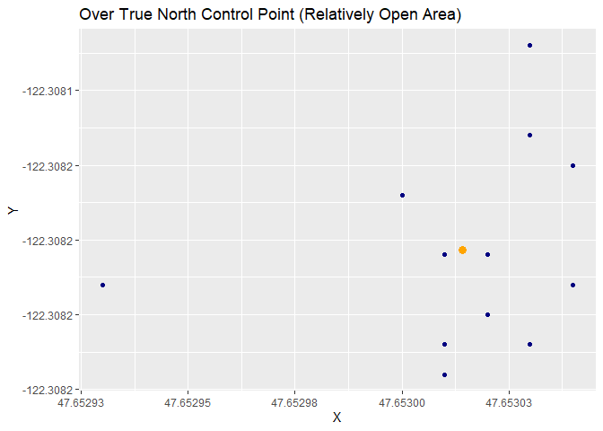

GPS Coordinate Plots
================
Surakshya Dhakal
May 15, 2019

**The exercise aims to explore the possibilities of handheld GNSS/GPS
receivers and increase the understanding of some errors and their
consequences.**

## Read in the Datasets

``` r
# GPS coordinates collected outside Bloedel Hall
ob <- read.csv("../data/OutsideBloedel.csv")

# GPS coordinates collected over the True North control point
tn <- read.csv("../data/TrueNorth.csv")

# GPS coordinates collected in the Medicinal Herb Garden
mgh <- read.csv("../data/MedicinalHerbGarden.csv")
```

## Create Plots

``` r
ob_mean <- ob %>%
  summarise(X = mean(X),
            Y  = mean(Y))

ggplot(ob, aes(x = X, y = Y)) +
  geom_point(color = "orangered3") +
  geom_point(data = ob_mean, size = 3, shape = 19, colour = "orange") +
  scale_fill_hue(c=100, l=100) +
  ggtitle("Outside a Building with Other Concrete Structures and Trees Around")
```

<!-- -->

``` r
dev.copy(png,'../figures/OB.png')
```

    ## png 
    ##   3

``` r
dev.off()
```

    ## png 
    ##   2

``` r
tn_mean <- tn %>%
  summarise(X = mean(X),
            Y  = mean(Y))

ggplot(tn, aes(x = X, y = Y)) +
  geom_point(color = "navy") +
  geom_point(data = tn_mean, size = 3, shape = 19, colour = "orange") +
  ggtitle("Over True North Control Point (Relatively Open Area)")
```

<!-- -->

``` r
dev.copy(png,'../figures/TN.png')
```

    ## png 
    ##   3

``` r
dev.off()
```

    ## png 
    ##   2

``` r
mgh_mean <- mgh %>%
  summarise(X = mean(X),
            Y  = mean(Y))

ggplot(mgh, aes(x = X, y = Y)) +
  geom_point(color = "green4") +
  geom_point(data = mgh_mean, size = 3, shape = 19, colour = "orange") +
  ggtitle("In Forested Area")
```

<!-- -->

``` r
dev.copy(png,'../figures/MGH.png')
```

    ## png 
    ##   3

``` r
dev.off()
```

    ## png 
    ##   2
